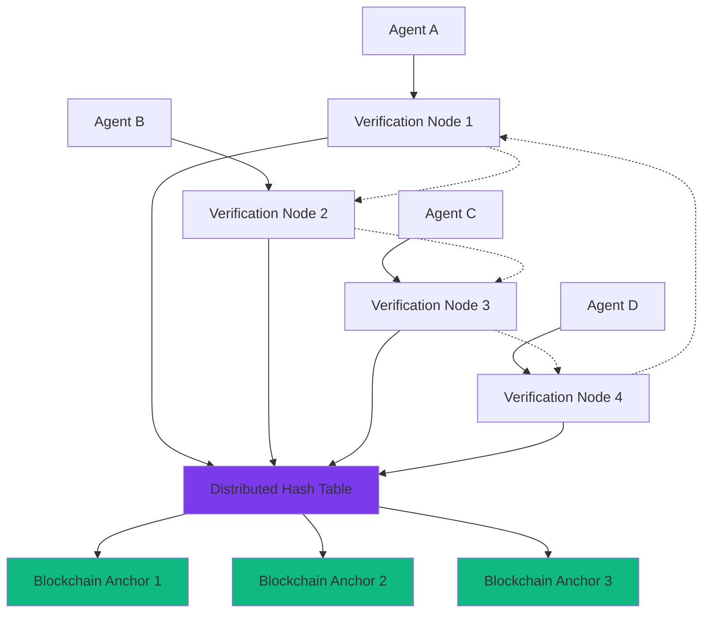

# TrustWrapper v2.0 Decentralized Verification Protocol

**Version**: 2.0.0  
**Date**: June 25, 2025  
**Status**: Protocol Specification  

## Overview

The TrustWrapper Decentralized Verification Protocol (TDVP) enables optional peer-to-peer verification attestation sharing without relying on centralized infrastructure, eliminating single points of failure while maintaining privacy through zero-knowledge proofs.

## 🎯 Protocol Objectives

1. **Decentralization**: No single point of failure or control
2. **Privacy Preservation**: Zero trading strategy disclosure
3. **Consensus Formation**: Distributed agreement on verification standards
4. **Scalability**: Support for thousands of participating agents
5. **Incentive Alignment**: Economic rewards for honest participation

## 🏗️ Protocol Architecture

### Network Topology



### Core Components

#### 1. Verification Nodes
- **Purpose**: Validate and relay verification attestations
- **Requirements**: Stake tokens, maintain uptime, validate proofs
- **Rewards**: Earned for honest participation and uptime

#### 2. Distributed Hash Table (DHT)
- **Purpose**: Store and discover verification attestations
- **Technology**: Kademlia-based DHT with cryptographic addressing
- **Data**: ZK proofs, attestations, reputation scores

#### 3. Blockchain Anchors
- **Purpose**: Immutable timestamping and dispute resolution
- **Chains**: Multi-chain support (Ethereum, Cardano, Solana, etc.)
- **Frequency**: Periodic commitment of DHT state

## 📡 Protocol Messages

### Attestation Publication
```typescript
interface AttestationMessage {
  version: "2.0.0";
  type: "VERIFICATION_ATTESTATION";
  
  // Verification proof (zero-knowledge)
  zkProof: ZKProof;
  
  // Public attestation data
  attestation: {
    agentId: PublicKey;
    trustScore: number;        // 0-100
    riskLevel: RiskLevel;      // low/medium/high/critical
    timestamp: number;         // Unix timestamp
    verifierVersion: string;   // "2.0.0"
  };
  
  // Network routing
  messageId: string;
  ttl: number;              // Time to live
  signature: Signature;     // Agent signature
}
```

### Verification Request
```typescript
interface VerificationRequest {
  version: "2.0.0";
  type: "VERIFICATION_REQUEST";
  
  // Request details
  requestId: string;
  requesterAgentId: PublicKey;
  
  // What to verify
  criteria: {
    minTrustScore?: number;
    maxRiskLevel?: RiskLevel;
    timeWindow?: number;      // Seconds
    verifierReputationMin?: number;
  };
  
  // Incentives
  rewardOffered?: TokenAmount;
  
  signature: Signature;
}
```

### Consensus Formation
```typescript
interface ConsensusMessage {
  version: "2.0.0";
  type: "CONSENSUS_VOTE";
  
  // What we're voting on
  proposalId: string;
  proposalType: "RULE_UPDATE" | "NODE_REPUTATION" | "PROTOCOL_UPGRADE";
  
  // Vote details
  vote: "APPROVE" | "REJECT" | "ABSTAIN";
  weight: number;           // Voting weight based on stake
  justification?: string;   // Optional reasoning
  
  // Voter identity
  voterId: PublicKey;
  timestamp: number;
  signature: Signature;
}
```

## 🔄 Protocol Operations

### 1. Attestation Flow

```typescript
class DecentralizedVerificationNode {
  async publishAttestation(
    zkProof: ZKProof,
    attestation: VerificationAttestation
  ): Promise<AttestationReceipt> {
    
    // 1. Validate ZK proof locally
    const proofValid = await this.zkVerifier.verifyProof(zkProof);
    if (!proofValid) {
      throw new Error('Invalid ZK proof');
    }

    // 2. Create attestation message
    const message: AttestationMessage = {
      version: "2.0.0",
      type: "VERIFICATION_ATTESTATION",
      zkProof,
      attestation,
      messageId: this.generateMessageId(),
      ttl: 3600, // 1 hour
      signature: await this.signMessage(attestation)
    };

    // 3. Store in local DHT
    await this.dht.store(message.messageId, message);

    // 4. Propagate to peer nodes
    const propagationResults = await this.propagateMessage(message);

    // 5. Optional blockchain anchoring
    if (this.shouldAnchor(attestation)) {
      await this.anchorToBlockchain(message);
    }

    return {
      messageId: message.messageId,
      propagated: propagationResults.success,
      anchored: true,
      timestamp: Date.now()
    };
  }

  async queryAttestations(
    criteria: VerificationCriteria
  ): Promise<VerificationAttestation[]> {
    
    // 1. Query local DHT
    const localResults = await this.dht.query(criteria);

    // 2. Query peer nodes
    const peerResults = await this.queryPeers(criteria);

    // 3. Merge and deduplicate
    const allResults = [...localResults, ...peerResults];
    const unique = this.deduplicateAttestations(allResults);

    // 4. Validate all ZK proofs
    const validAttestations = [];
    for (const attestation of unique) {
      const isValid = await this.zkVerifier.verifyProof(attestation.zkProof);
      if (isValid) {
        validAttestations.push(attestation);
      }
    }

    // 5. Sort by relevance and reputation
    return this.rankAttestations(validAttestations, criteria);
  }
}
```

### 2. Consensus Mechanism

```typescript
class ConsensusEngine {
  async proposeRuleUpdate(
    newRules: VerificationRules,
    justification: string
  ): Promise<ProposalId> {
    
    // 1. Create proposal
    const proposal: RuleProposal = {
      proposalId: this.generateProposalId(),
      type: "RULE_UPDATE",
      proposer: this.nodeId,
      newRules,
      justification,
      votingPeriod: 7 * 24 * 3600, // 7 days
      timestamp: Date.now()
    };

    // 2. Stake tokens for proposal
    await this.stakeManager.lockStake(proposal.proposalId, this.PROPOSAL_STAKE);

    // 3. Broadcast proposal
    await this.broadcastMessage({
      type: "PROPOSAL",
      proposal,
      signature: await this.signMessage(proposal)
    });

    // 4. Start voting period
    this.votingManager.startVoting(proposal);

    return proposal.proposalId;
  }

  async vote(
    proposalId: ProposalId,
    vote: VoteChoice,
    justification?: string
  ): Promise<void> {
    
    // 1. Validate voting eligibility
    const eligible = await this.validateVotingEligibility(proposalId);
    if (!eligible) {
      throw new Error('Not eligible to vote on this proposal');
    }

    // 2. Calculate voting weight
    const weight = await this.calculateVotingWeight();

    // 3. Create vote message
    const voteMessage: ConsensusMessage = {
      version: "2.0.0",
      type: "CONSENSUS_VOTE",
      proposalId,
      proposalType: "RULE_UPDATE",
      vote,
      weight,
      justification,
      voterId: this.nodeId,
      timestamp: Date.now(),
      signature: await this.signMessage({ proposalId, vote, weight })
    };

    // 4. Submit vote
    await this.submitVote(voteMessage);

    // 5. Update local vote tracking
    this.voteTracker.recordVote(proposalId, voteMessage);
  }

  async tallyVotes(proposalId: ProposalId): Promise<VotingResult> {
    // 1. Collect all votes
    const votes = await this.collectVotes(proposalId);

    // 2. Validate vote signatures
    const validVotes = [];
    for (const vote of votes) {
      const isValid = await this.verifyVoteSignature(vote);
      if (isValid) {
        validVotes.push(vote);
      }
    }

    // 3. Calculate results
    let approveWeight = 0;
    let rejectWeight = 0;
    let abstainWeight = 0;

    for (const vote of validVotes) {
      switch (vote.vote) {
        case "APPROVE":
          approveWeight += vote.weight;
          break;
        case "REJECT":
          rejectWeight += vote.weight;
          break;
        case "ABSTAIN":
          abstainWeight += vote.weight;
          break;
      }
    }

    const totalWeight = approveWeight + rejectWeight + abstainWeight;
    const approvalRatio = approveWeight / (approveWeight + rejectWeight);

    // 4. Determine outcome
    const passed = approvalRatio >= 0.67; // 2/3 majority required

    return {
      proposalId,
      totalVotes: validVotes.length,
      totalWeight,
      approveWeight,
      rejectWeight,
      abstainWeight,
      approvalRatio,
      passed,
      timestamp: Date.now()
    };
  }
}
```

### 3. Reputation System

```typescript
class ReputationManager {
  async calculateNodeReputation(nodeId: PublicKey): Promise<ReputationScore> {
    // 1. Collect performance metrics
    const metrics = await this.collectMetrics(nodeId);

    // 2. Calculate component scores
    const uptimeScore = this.calculateUptimeScore(metrics.uptime);
    const validationScore = this.calculateValidationScore(metrics.validations);
    const stakeScore = this.calculateStakeScore(metrics.stake);
    const ageScore = this.calculateAgeScore(metrics.nodeAge);

    // 3. Apply weights and combine
    const reputation = (
      uptimeScore * 0.3 +
      validationScore * 0.4 +
      stakeScore * 0.2 +
      ageScore * 0.1
    );

    return {
      nodeId,
      reputation: Math.max(0, Math.min(100, reputation)),
      components: {
        uptime: uptimeScore,
        validation: validationScore,
        stake: stakeScore,
        age: ageScore
      },
      lastUpdated: Date.now()
    };
  }

  async penalizeNode(
    nodeId: PublicKey,
    violation: ViolationType,
    severity: number
  ): Promise<void> {
    
    // 1. Calculate penalty
    const penalty = this.calculatePenalty(violation, severity);

    // 2. Apply reputation penalty
    await this.applyReputationPenalty(nodeId, penalty);

    // 3. Slash stake if severe
    if (severity >= 0.8) {
      await this.slashStake(nodeId, penalty * 0.1);
    }

    // 4. Record violation
    await this.recordViolation(nodeId, violation, penalty);

    // 5. Broadcast penalty to network
    await this.broadcastPenalty(nodeId, violation, penalty);
  }
}
```

## 🎁 Incentive Mechanism

### Token Economics
```typescript
interface TokenEconomics {
  // Staking requirements
  minimumStake: TokenAmount;        // Required to become verification node
  
  // Rewards
  attestationReward: TokenAmount;   // Per valid attestation
  uptimeReward: TokenAmount;        // Per hour of uptime
  validationReward: TokenAmount;    // Per proof validation
  
  // Penalties
  downPenalty: TokenAmount;         // Per hour of downtime
  invalidPenalty: TokenAmount;      // Per invalid attestation
  slashingRate: number;             // 0.0-1.0 for severe violations
}
```

### Reward Distribution
```typescript
class IncentiveManager {
  async distributeRewards(epoch: number): Promise<RewardDistribution> {
    // 1. Calculate total rewards for epoch
    const totalRewards = await this.calculateEpochRewards(epoch);

    // 2. Get all active nodes
    const activeNodes = await this.getActiveNodes(epoch);

    // 3. Calculate individual rewards
    const distributions: NodeReward[] = [];
    
    for (const node of activeNodes) {
      const nodeMetrics = await this.getNodeMetrics(node.id, epoch);
      const nodeReward = this.calculateNodeReward(nodeMetrics, totalRewards);
      
      distributions.push({
        nodeId: node.id,
        reward: nodeReward,
        breakdown: this.getRewardBreakdown(nodeMetrics)
      });
    }

    // 4. Execute token transfers
    await this.executeRewardTransfers(distributions);

    return {
      epoch,
      totalDistributed: totalRewards,
      nodeCount: activeNodes.length,
      distributions
    };
  }
}
```

## 🔐 Security Considerations

### Attack Vectors and Mitigations

#### 1. Sybil Attacks
- **Attack**: Creating multiple fake nodes to manipulate consensus
- **Mitigation**: Stake requirements, reputation scoring, proof-of-work for node creation

#### 2. Eclipse Attacks
- **Attack**: Isolating nodes from honest network
- **Mitigation**: Multiple connection paths, blockchain anchoring, timeout mechanisms

#### 3. Long-Range Attacks
- **Attack**: Rewriting network history
- **Mitigation**: Blockchain checkpoints, stake slashing, social consensus

#### 4. Nothing-at-Stake
- **Attack**: Voting on multiple competing proposals
- **Mitigation**: Stake locking during voting periods, slashing for double-voting

## 📊 Performance Specifications

### Network Metrics
- **Latency**: <5s for attestation propagation
- **Throughput**: >1000 attestations/second network-wide
- **Storage**: <1GB per node for DHT data
- **Bandwidth**: <10MB/hour per node

### Consensus Performance
- **Voting Period**: 7 days for rule updates
- **Proposal Threshold**: 1% network stake
- **Approval Threshold**: 67% of participating stake
- **Finality**: Immediate with 67% consensus

## 🛠️ Implementation Roadmap

### Phase 1: Core Infrastructure (Weeks 1-2)
- [ ] DHT implementation with Kademlia
- [ ] Basic message routing and validation
- [ ] ZK proof integration
- [ ] Simple reputation system

### Phase 2: Consensus Mechanism (Weeks 3-4)
- [ ] Proposal system
- [ ] Voting mechanisms
- [ ] Stake management
- [ ] Penalty system

### Phase 3: Incentives (Weeks 5-6)
- [ ] Token reward system
- [ ] Automatic distribution
- [ ] Performance monitoring
- [ ] Economic balancing

### Phase 4: Production Hardening (Weeks 7-8)
- [ ] Security audits
- [ ] Performance optimization
- [ ] Documentation
- [ ] Integration testing

---

This decentralized protocol ensures TrustWrapper v2.0 can operate without central authorities while maintaining security and privacy through cryptographic guarantees.