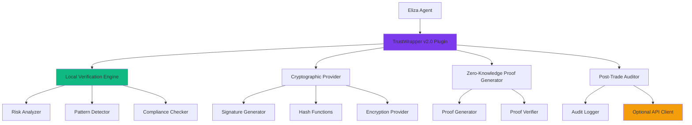

# TrustWrapper v2.0 Local-First Architecture

**Version**: 2.0.0  
**Date**: June 25, 2025  
**Status**: Design Specification  

## Overview

TrustWrapper v2.0 implements a local-first architecture that eliminates the critical security vulnerabilities of v1.0 by ensuring all pre-trade verification occurs within the agent's secure environment, with no external dependencies or data transmission.

## 🎯 Architecture Principles

1. **Local-First**: Core functionality works without network access
2. **Privacy by Design**: No sensitive data leaves the agent environment
3. **Zero External Dependencies**: Self-contained verification logic
4. **Cryptographically Secure**: All results are tamper-proof
5. **Performance Optimized**: <10ms verification latency
6. **Backward Compatible**: Clean migration from v1.0

## 🏗️ System Architecture

### Core Components



### Component Responsibilities

#### 1. Local Verification Engine
- **Purpose**: Core verification logic running entirely locally
- **Dependencies**: None (self-contained)
- **Data Flow**: Input → Analysis → Result (no external calls)

```typescript
interface LocalVerificationEngine {
  verifyTradingDecision(
    decision: TradingDecision,
    options?: VerificationOptions
  ): Promise<VerificationResult>;
  
  verifyBatch(
    decisions: TradingDecision[]
  ): Promise<VerificationResult[]>;
  
  updateRules(
    rules: VerificationRules
  ): void;
}
```

#### 2. Cryptographic Provider
- **Purpose**: Secure cryptographic operations for integrity protection
- **Algorithms**: Ed25519, ChaCha20-Poly1305, BLAKE3
- **Security**: Constant-time operations, secure random generation

```typescript
interface CryptographicProvider {
  signResult(result: VerificationResult): Promise<Signature>;
  verifySignature(result: VerificationResult, sig: Signature): Promise<boolean>;
  generateNonce(): string;
  hashDecision(decision: TradingDecision): string;
}
```

#### 3. Zero-Knowledge Proof System
- **Purpose**: Share verification status without revealing trading details
- **Technology**: zk-SNARKs for verification attestation
- **Privacy**: Complete trading strategy confidentiality

```typescript
interface ZKProofSystem {
  generateProof(
    decision: TradingDecision,
    verification: VerificationResult,
    circuitParams: CircuitParameters
  ): Promise<ZKProof>;
  
  verifyProof(
    proof: ZKProof,
    publicInputs: PublicInputs
  ): Promise<boolean>;
  
  generateCircuit(
    verificationLogic: VerificationLogic
  ): Circuit;
}
```

## 🔧 Implementation Specification

### Local Verification Engine

```typescript
class LocalVerificationEngine {
  private readonly riskAnalyzer: RiskAnalyzer;
  private readonly patternDetector: PatternDetector;
  private readonly complianceChecker: ComplianceChecker;
  private readonly cryptoProvider: CryptographicProvider;

  constructor(config: LocalVerificationConfig) {
    this.riskAnalyzer = new RiskAnalyzer(config.riskRules);
    this.patternDetector = new PatternDetector(config.patterns);
    this.complianceChecker = new ComplianceChecker(config.compliance);
    this.cryptoProvider = new CryptographicProvider();
  }

  async verifyTradingDecision(
    decision: TradingDecision,
    context: VerificationContext = {}
  ): Promise<SignedVerificationResult> {
    
    // 1. Input validation
    this.validateInput(decision);
    
    // 2. Risk analysis
    const riskAssessment = await this.riskAnalyzer.analyze(decision);
    
    // 3. Pattern detection
    const patterns = await this.patternDetector.detect(decision);
    
    // 4. Compliance checking
    const compliance = await this.complianceChecker.check(decision, context);
    
    // 5. Aggregate results
    const result = this.aggregateResults(riskAssessment, patterns, compliance);
    
    // 6. Cryptographic signing
    const signature = await this.cryptoProvider.signResult(result);
    
    return {
      ...result,
      signature,
      timestamp: Date.now(),
      nonce: this.cryptoProvider.generateNonce(),
      version: '2.0.0'
    };
  }

  private validateInput(decision: TradingDecision): void {
    if (!decision.action || !decision.asset) {
      throw new ValidationError('Missing required fields');
    }
    
    if (decision.amount && decision.amount <= 0) {
      throw new ValidationError('Invalid amount');
    }
    
    // Additional validation logic
  }

  private aggregateResults(
    risk: RiskAssessment,
    patterns: PatternDetection,
    compliance: ComplianceResult
  ): VerificationResult {
    
    const warnings: string[] = [];
    let trustScore = 100;
    let riskLevel: RiskLevel = 'low';
    
    // Risk assessment impact
    trustScore -= risk.score;
    warnings.push(...risk.warnings);
    
    // Pattern detection impact
    if (patterns.suspiciousPatterns.length > 0) {
      trustScore -= patterns.severity * 10;
      warnings.push(...patterns.warnings);
    }
    
    // Compliance impact
    if (!compliance.compliant) {
      trustScore -= 20;
      warnings.push(...compliance.violations);
    }
    
    // Determine risk level
    if (trustScore < 30) riskLevel = 'critical';
    else if (trustScore < 50) riskLevel = 'high';
    else if (trustScore < 70) riskLevel = 'medium';
    
    return {
      verified: riskLevel !== 'critical',
      trustScore: Math.max(0, trustScore),
      riskLevel,
      warnings,
      recommendation: this.getRecommendation(riskLevel),
      details: {
        riskAssessment: risk,
        patterns,
        compliance,
        verificationMethod: 'local-v2'
      }
    };
  }
}
```

### Risk Analysis Engine

```typescript
class RiskAnalyzer {
  private readonly scamPatterns: RegExp[];
  private readonly riskTokens: Set<string>;
  private readonly suspiciousActions: string[];

  constructor(config: RiskAnalysisConfig) {
    this.scamPatterns = config.scamPatterns.map(p => new RegExp(p, 'i'));
    this.riskTokens = new Set(config.riskTokens);
    this.suspiciousActions = config.suspiciousActions;
  }

  async analyze(decision: TradingDecision): Promise<RiskAssessment> {
    const warnings: string[] = [];
    let score = 0;

    // Scam pattern detection
    if (decision.reasoning) {
      for (const pattern of this.scamPatterns) {
        if (pattern.test(decision.reasoning)) {
          warnings.push(`Suspicious pattern detected: ${pattern.source}`);
          score += 25;
        }
      }
    }

    // Risk token detection
    if (this.riskTokens.has(decision.asset.toLowerCase())) {
      warnings.push(`High-risk token: ${decision.asset}`);
      score += 40;
    }

    // Suspicious action detection
    if (this.suspiciousActions.includes(decision.action.toLowerCase())) {
      warnings.push(`Suspicious action: ${decision.action}`);
      score += 15;
    }

    // Amount risk analysis
    if (decision.amount && decision.amount > 100000) {
      warnings.push('Large transaction amount detected');
      score += 10;
    }

    // Leverage risk
    if (decision.leverage && decision.leverage > 10) {
      warnings.push(`High leverage detected: ${decision.leverage}x`);
      score += 20;
    }

    return {
      score,
      warnings,
      details: {
        patternsFound: warnings.length,
        severityLevel: this.calculateSeverity(score),
        timestamp: Date.now()
      }
    };
  }

  private calculateSeverity(score: number): 'low' | 'medium' | 'high' | 'critical' {
    if (score >= 70) return 'critical';
    if (score >= 50) return 'high';
    if (score >= 30) return 'medium';
    return 'low';
  }
}
```

### Zero-Knowledge Proof Implementation

```typescript
class ZKProofGenerator {
  private readonly circuit: Circuit;
  private readonly provingKey: ProvingKey;
  private readonly verifyingKey: VerifyingKey;

  constructor(circuitConfig: CircuitConfig) {
    this.circuit = this.buildCircuit(circuitConfig);
    const keys = this.generateKeys(this.circuit);
    this.provingKey = keys.proving;
    this.verifyingKey = keys.verifying;
  }

  async generateProof(
    decision: TradingDecision,
    verification: VerificationResult
  ): Promise<ZKProof> {
    
    // Private inputs (never revealed)
    const privateInputs = {
      asset: decision.asset,
      amount: decision.amount,
      reasoning: decision.reasoning,
      strategy: decision.strategy
    };

    // Public inputs (can be shared)
    const publicInputs = {
      trustScore: verification.trustScore,
      riskLevel: verification.riskLevel,
      timestamp: verification.timestamp,
      verificationHash: this.hashVerification(verification)
    };

    // Generate proof
    const proof = await this.circuit.generateProof(
      privateInputs,
      publicInputs,
      this.provingKey
    );

    return {
      proof,
      publicInputs,
      metadata: {
        version: '2.0.0',
        circuit: this.circuit.identifier,
        timestamp: Date.now()
      }
    };
  }

  async verifyProof(zkProof: ZKProof): Promise<boolean> {
    return await this.circuit.verifyProof(
      zkProof.proof,
      zkProof.publicInputs,
      this.verifyingKey
    );
  }

  private buildCircuit(config: CircuitConfig): Circuit {
    // Circuit that proves verification was performed correctly
    // without revealing the trading decision details
    return new Circuit(`
      // Public inputs
      signal input trustScore;
      signal input riskLevel;
      signal input timestamp;
      signal input verificationHash;
      
      // Private inputs (trading decision)
      signal private input asset;
      signal private input amount;
      signal private input reasoning;
      
      // Constraints
      component verifier = VerificationLogic();
      verifier.asset <== asset;
      verifier.amount <== amount;
      verifier.reasoning <== reasoning;
      
      // Ensure verification was performed correctly
      verifier.trustScore === trustScore;
      verifier.riskLevel === riskLevel;
      
      // Output valid verification proof
      signal output validVerification <== 1;
    `);
  }
}
```

## 📊 Performance Specifications

### Latency Requirements
- **Local Verification**: <10ms for simple decisions
- **Batch Verification**: <50ms for 10 decisions
- **ZK Proof Generation**: <1s for standard proofs
- **ZK Proof Verification**: <100ms per proof

### Memory Usage
- **Verification Engine**: <50MB resident memory
- **ZK Circuit**: <100MB for circuit storage
- **Proof Storage**: <1KB per proof
- **Cache Size**: <10MB for pattern cache

### Throughput
- **Verifications**: >1000 per second
- **Proof Generation**: >10 per second
- **Proof Verification**: >100 per second
- **Batch Processing**: >100 decisions per batch

## 🔐 Security Features

### Cryptographic Security
- **Signature Algorithm**: Ed25519 (128-bit security)
- **Hash Function**: BLAKE3 (collision resistant)
- **Random Generation**: Cryptographically secure PRNG
- **Timing Attack Resistance**: Constant-time operations

### Integrity Protection
- **Result Signing**: All verification results cryptographically signed
- **Nonce Usage**: Prevents replay attacks
- **Timestamp Validation**: Ensures freshness
- **Input Sanitization**: Prevents injection attacks

### Privacy Protection
- **No External Calls**: Zero network communication for verification
- **Memory Security**: Sensitive data cleared after use
- **Error Handling**: No sensitive data in error messages
- **Audit Logs**: Local-only, encrypted if persistent

## 📋 Configuration

### Verification Rules
```typescript
interface VerificationConfig {
  riskRules: {
    scamPatterns: string[];
    riskTokens: string[];
    maxAmount: number;
    maxLeverage: number;
  };
  
  complianceRules: {
    jurisdictions: string[];
    requiredChecks: string[];
    auditRequirements: AuditConfig;
  };
  
  performance: {
    maxLatency: number;
    batchSize: number;
    cacheSize: number;
  };
}
```

### Runtime Options
```typescript
interface VerificationOptions {
  strictMode?: boolean;
  auditLevel?: 'none' | 'basic' | 'detailed';
  zkProofGeneration?: boolean;
  customRules?: CustomRule[];
}
```

## 🔄 Migration from v1.0

### Automatic Detection
```typescript
class V1MigrationDetector {
  detectV1Usage(code: string): MigrationAlert[] {
    const alerts: MigrationAlert[] = [];
    
    // Detect v1.0 API calls
    if (code.includes('trustWrapper.verify(')) {
      alerts.push({
        type: 'critical',
        message: 'v1.0 API call detected - replace with local verification',
        suggestion: 'Use localVerifier.verifyTradingDecision()'
      });
    }
    
    return alerts;
  }
}
```

### Configuration Migration
```typescript
class ConfigMigrator {
  migrateV1Config(v1Config: V1Config): V2Config {
    return {
      verificationRules: this.convertVerificationRules(v1Config.rules),
      localMode: true,
      externalApiEnabled: false,
      zkProofEnabled: v1Config.privacyMode === 'high',
      auditMode: v1Config.complianceMode ? 'detailed' : 'basic'
    };
  }
}
```

---

This local-first architecture ensures TrustWrapper v2.0 provides secure, private, and efficient verification without the critical vulnerabilities of v1.0.